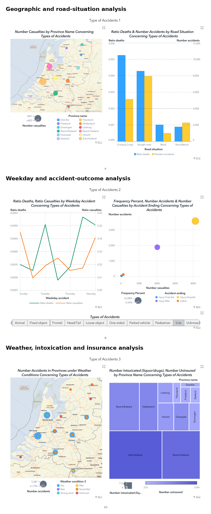
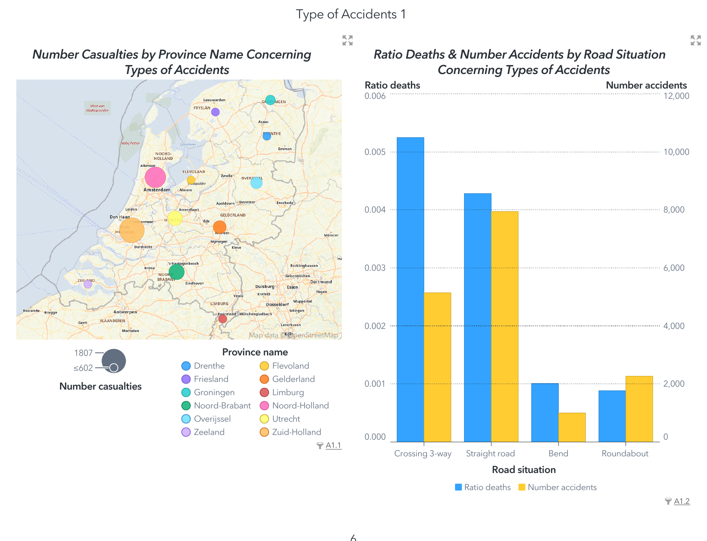
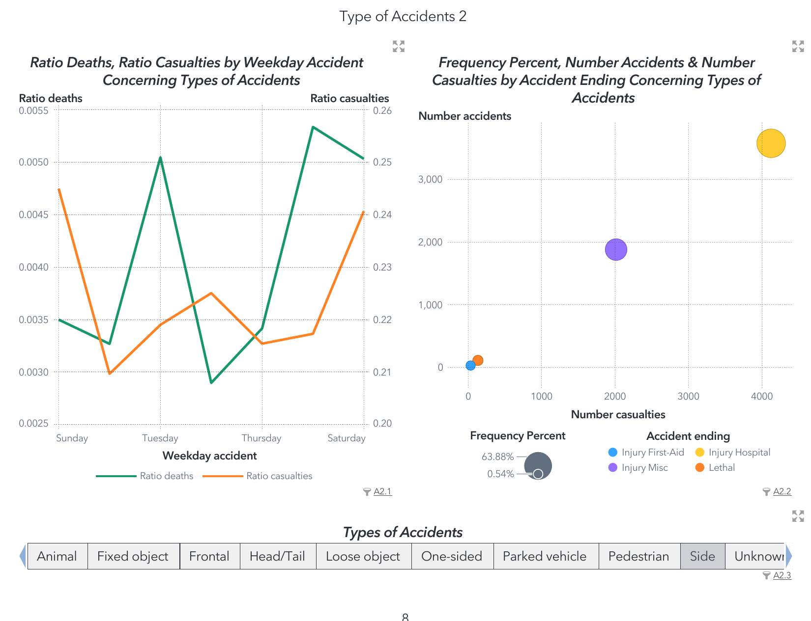
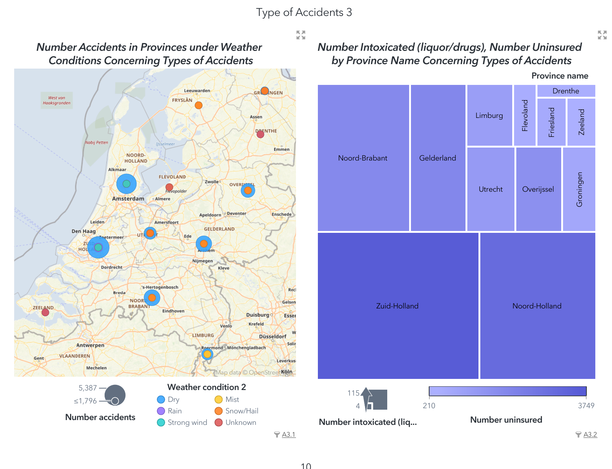

# Causes of Traffic Accidents in the Netherlands

## SAS Viya Visual Analytics Project



This portfolio project analyses patterns associated with traffic accidents in the Netherlands using **SAS Viya** and **SAS Visual Analytics**. The work examines how accident type relates to geography, road situation, casualty outcomes, weekday patterns, weather conditions, intoxication records, and uninsured vehicles.

The original project question was how traffic accidents might be prevented. The analysis therefore focuses on descriptive patterns that can help identify areas for further investigation and potential road-safety interventions.

> **Important analytical note:** This is an exploratory and descriptive dashboard project. The visualisations identify associations in aggregated data; they do not establish that any variable directly caused an accident.

## Project Overview

- **Project:** Causes of Traffic Accidents in the Netherlands
- **Platform:** SAS Viya for Learners
- **Visualisation tool:** SAS Visual Analytics
- **Analysis type:** Exploratory and descriptive data analysis
- **Primary output:** Multi-page visual analytics report and dashboard
- **Dataset:** Case Study - Dutch Traffic Accidents, available through SAS Viya for Learners

The source dataset contained approximately **57 numeric and categorical variables**. The project selected variables relevant to accident frequency, severity, location, road conditions, and potential risk indicators.

## Skills Demonstrated

- SAS Viya
- SAS Visual Analytics
- Data preparation and variable selection
- Exploratory data analysis
- Geographic visualisation
- Dual-axis charts
- Time-series comparison
- Bubble plots and treemaps
- Dashboard filters and interactions
- Analytical reporting
- Data storytelling
- Interpretation of limitations

## Questions Explored

1. Which provinces recorded the highest accident and casualty counts?
2. How did accident patterns vary by road situation?
3. How did death and casualty ratios vary across weekdays?
4. What types of accident outcomes were most frequent?
5. How did weather conditions relate to recorded accidents across provinces?
6. Which provinces recorded higher counts of intoxication and uninsured vehicles?

## Variables Used

The dashboard used the following fields from the wider dataset:

- Type of accident
- Number of accidents
- Number of casualties
- Province name
- Ratio of deaths
- Road situation
- Ratio of casualties
- Weekday of accident
- Accident ending or outcome
- Weather condition
- Number intoxicated (liquor/drugs)
- Number uninsured

## Dashboard Design

### Analysis 1: Geography, casualties and road situation



This page combines:

- A geographic bubble map showing casualty counts by province
- A dual-axis bar chart comparing death ratio and accident count by road situation
- Accident-type filtering

The project found that **Zuid-Holland recorded the highest casualty count in the selected side-accident view**, while straight roads had the largest accident count among the displayed road situations.

### Analysis 2: Weekday patterns and accident outcomes



This page combines:

- A dual-axis weekday plot for death and casualty ratios
- A bubble plot comparing accident counts, casualty counts and percentage frequency by outcome
- An accident-type selector

Hospital-injury outcomes contained the largest casualty total in the displayed outcome analysis. Material-only outcomes were discussed in the written report, while the exported bubble visual focuses on injury and lethal outcome categories.

### Analysis 3: Weather, intoxication and uninsured vehicles



This page combines:

- A geographic map of accident counts by province and weather condition
- A treemap comparing intoxication and uninsured-vehicle counts by province
- Accident-type filtering

The displayed views highlighted large recorded values in **Zuid-Holland**, including dry-weather accidents and the highest counts of intoxication and uninsured vehicles in the selected analysis.

## Selected Findings

The report identified the following descriptive patterns:

- Zuid-Holland had the highest displayed casualty count for the selected side-accident analysis.
- Straight roads had the highest displayed accident count among the road-situation categories.
- Hospital-injury outcomes contained the highest casualty count in the outcome view.
- Dry weather accounted for many of the displayed provincial accident records.
- Zuid-Holland showed the highest displayed counts for intoxication and uninsured vehicles.
- Side accidents appeared frequently across several dashboard views.

These findings should be interpreted as **signals for deeper investigation**, not proof of causation. Individual-level records, exposure measures, population size, traffic volume, and statistical controls would be needed for stronger conclusions.

## Dashboard Objects Used

| Dashboard section | SAS Visual Analytics object | Purpose |
|---|---|---|
| Analysis 1 | Geo coordinate map | Compare casualties across provinces |
| Analysis 1 | Dual-axis bar chart | Compare death ratio and accident count by road situation |
| Analysis 2 | Dual-axis time-series plot | Compare weekday death and casualty ratios |
| Analysis 2 | Bubble plot | Compare accident outcomes using accidents, casualties and frequency |
| Analysis 2 | Button bar/filter | Select accident type |
| Analysis 3 | Geo coordinate map | Compare provincial accidents under weather conditions |
| Analysis 3 | Treemap | Compare intoxication and uninsured-vehicle counts by province |

## Repository Structure

```text
netherlands-traffic-accidents-sas/
|
|-- README.md
|-- assets/
|   |-- dashboard-overview.png
|   |-- dashboard-analysis-1.png
|   |-- dashboard-analysis-2.png
|   `-- dashboard-analysis-3.png
|-- docs/
|   |-- final-project-report.pdf
|   |-- methodology-and-dashboard-design.md
|   `-- findings-and-limitations.md
|-- data/
|   `-- README.md
|-- CITATION.cff
|-- NOTICE.md
`-- .gitignore
```

## Project Report

[Read the complete project report](docs/final-project-report.pdf)

The PDF contains the executive summary, variable selection, three dashboard analyses, conclusions, recommendations, dashboard filters, and supporting exported tables.

## Reproducing the Project

The original dataset was accessed through **SAS Viya for Learners** and is not redistributed in this repository. To reproduce the work:

1. Obtain authorised access to the Dutch Traffic Accidents case-study dataset in SAS Viya.
2. Review the selected variables listed above.
3. Prepare categories and calculated measures such as death and casualty ratios where required.
4. Build the dashboard objects described in [`docs/methodology-and-dashboard-design.md`](docs/methodology-and-dashboard-design.md).
5. Apply accident-type and missing-value filters.
6. Validate chart totals and document analytical limitations.

## Limitations and Improvements

The project is based on aggregated descriptive analysis. Important limitations include:

- The dashboard cannot establish causal relationships.
- Counts are not adjusted for provincial population, traffic volume, road length or exposure.
- Unknown categories may affect interpretation.
- Relationships between intoxication, insurance status and accident type were not tested at individual-record level.
- Ratio values require careful interpretation when underlying group sizes differ.

Future improvements could include exposure-adjusted rates, statistical testing, trend analysis over time, severity modelling, missing-data assessment, and a clearer separation between observed evidence and hypotheses.

## Author

**Madiha Ahmadi**  
MSc Data Science Graduate

- [GitHub profile](https://github.com/Mahmadi96)
- [LinkedIn](ADD-YOUR-LINKEDIN-URL)

## Disclaimer

This is an academic portfolio project. The findings are intended to demonstrate data visualisation and analytical reporting skills and should not be treated as official road-safety or policy advice.
